```mermaid
flowchart TB
  subgraph Commands["⚡ Commands"]
    C23[SearchTracks]
    C24[SelectTrack]
  end

  subgraph Aggregates["📦 Aggregates"]
    A5[Track]
    A6[SearchQuery]
    A7[TrackList]
  end

  subgraph Events["📢 Events"]
    E13[TracksSearched]
    E14[TrackSelected]
    E15[TrackListLoaded]
  end

  Commands -.-> Aggregates
  Aggregates -.-> Events
```

```mermaid
flowchart TB
  subgraph Commands["⚡ Commands"]
    C25[PlayAudio]
    C26[PauseAudio]
    C27[SeekAudio]
  end

  subgraph Aggregates["📦 Aggregates"]
    A8[AudioPlayer]
    A9[PlaybackState]
  end

  subgraph Events["📢 Events"]
    E16[AudioStarted]
    E17[AudioPaused]
    E18[AudioSeeked]
  end

  Commands -.-> Aggregates
  Aggregates -.-> Events
```

```mermaid
flowchart TB
  subgraph Commands["⚡ Commands"]
    C28[CacheData]
    C29[InvalidateCache]
  end

  subgraph Aggregates["📦 Aggregates"]
    A10[Store]
    A11[Cache]
  end

  subgraph Events["📢 Events"]
    E19[DataCached]
    E20[CacheInvalidated]
  end

  Commands -.-> Aggregates
  Aggregates -.-> Events
```

```mermaid
flowchart TB
  subgraph Commands["⚡ Commands"]
    C30[FetchTracks]
    C31[FetchTrackDetail]
  end

  subgraph Aggregates["📦 Aggregates"]
    A12[JamendoAPI]
  end

  subgraph Events["📢 Events"]
    E21[APIRequestSent]
    E22[APIResponseReceived]
  end

  Commands -.-> Aggregates
  Aggregates -.-> Events
```

<!-- THIS FILE IS AUTO-GENERATED FROM spec/foundation.json -->
<!-- DO NOT EDIT THIS FILE DIRECTLY -->
<!-- Edit spec/foundation.json and run: fspec generate-foundation-md -->

# Jamendo Music App Project Foundation

## Vision

A React Native music streaming app that enables users to discover, browse, and play royalty-free music from Jamendo's extensive catalog with an intuitive mobile experience

---

## Problem Space

### Finding and accessing royalty-free music for content creation

Content creators, video producers, and developers need access to high-quality royalty-free music for their projects, but finding, previewing, and obtaining suitable tracks from large catalogs can be time-consuming and cumbersome without a dedicated mobile interface

**Impact:** high

---

## Solution Space

### Overview

A mobile-first music streaming application that connects to Jamendo's API, providing users with search capabilities, track browsing, detailed track information, and integrated audio playback - all optimized for mobile devices

### Capabilities

- **Search Music Tracks**: Users can search for music tracks by name using a text-based search interface with debounced input
- **Browse Track Results**: Users can view search results in an optimized, scrollable list showing track thumbnails, names, and artist information
- **View Track Details**: Users can view comprehensive track information including album art, track metadata, artist details, and duration
- **Play Audio Tracks**: Users can play, pause, and seek through audio tracks with visual progress indication and playback controls

---

## Personas

### Content Creator

Video producers, podcasters, and digital content creators who need royalty-free music for their projects

**Goals:**
- Quickly find and preview suitable royalty-free music tracks for their content

### Music Listener

Casual users who want to discover and enjoy royalty-free music on their mobile devices

**Goals:**
- Browse and listen to diverse royalty-free music tracks for personal enjoyment

---

# Domain Architecture

## Bounded Contexts

- Music Discovery
- Audio Playback
- State Management
- API Integration

## Bounded Context Map

## Music Discovery Context

### Event Flow

**Aggregates:**
- Track
- SearchQuery
- TrackList

**Domain Events:**
- TracksSearched
- TrackSelected
- TrackListLoaded

**Commands:**
- SearchTracks
- SelectTrack

## Audio Playback Context

### Event Flow

**Aggregates:**
- AudioPlayer
- PlaybackState

**Domain Events:**
- AudioStarted
- AudioPaused
- AudioSeeked

**Commands:**
- PlayAudio
- PauseAudio
- SeekAudio

## State Management Context

### Event Flow

**Aggregates:**
- Store
- Cache

**Domain Events:**
- DataCached
- CacheInvalidated

**Commands:**
- CacheData
- InvalidateCache

## API Integration Context

### Event Flow

**Aggregates:**
- JamendoAPI

**Domain Events:**
- APIRequestSent
- APIResponseReceived

**Commands:**
- FetchTracks
- FetchTrackDetail

---
